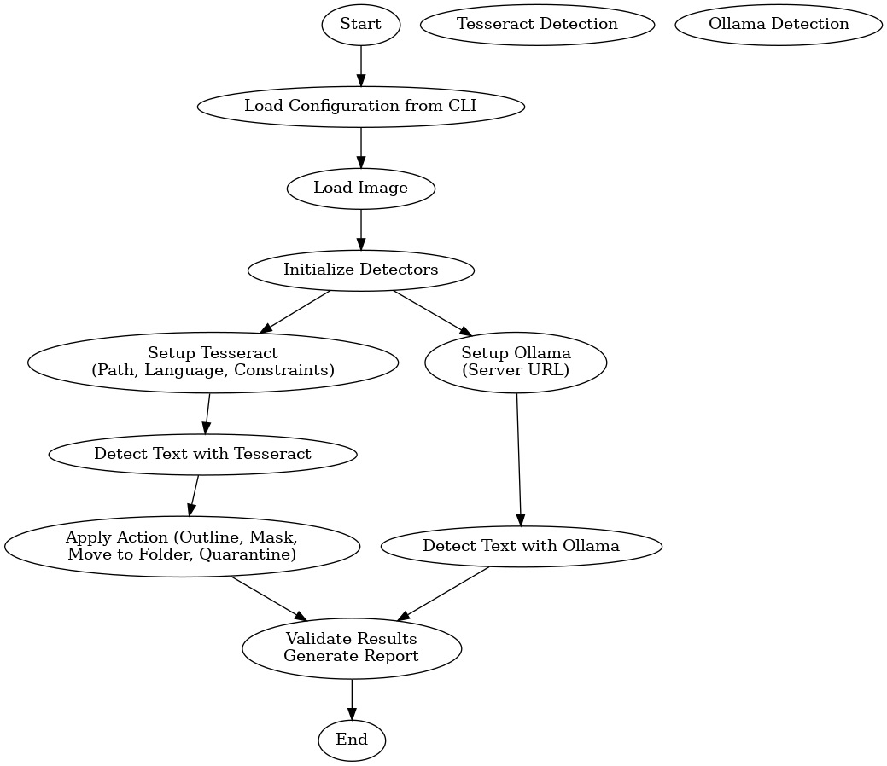

<!-- cp /usr/local/lib/libtesseract.dylib /Library/Java/JavaVirtualMachines/jdk-21.jdk/Contents/Home/lib/ -->
# VisionGuard

VisionGuard is a robust image processing and text detection system designed to process images, extract text, and apply various actions based on user-defined configurations. Leveraging the power of Tesseract OCR and external API integrations, VisionGuard provides a flexible and extensible platform for handling text detection tasks.



## Features

- **Text Detection**:
  - Detect text regions and extract textual content using Tesseract OCR.
  - External API support via OllamaTextDetector for alternative text extraction methods.

- **Configurable Actions**:

  - `OUTLINE`: Highlight detected text regions with bounding boxes.
  - `MASK`: Obscure detected text regions for privacy purposes.
  - `BURN`: Apply a semi-transparent red overlay to detected text regions.
  - `EXPORT_TO_FOLDER`: Save processed images and metadata to a designated folder.
  - `FLAG_FOR_REVIEW`: Mark images as needing further review by adding a "QUARANTINE" watermark.

- **Flexible Configuration**:
  - CLI arguments for dynamic bounding box constraints and folder paths.
  - Supports customizable detectors and actions.

- **Discrepancy Reporting**:
  - Generate reports comparing results from multiple detectors.

## Installation

### Prerequisites

1. **Java Development Kit (JDK)**: Ensure you have JDK 8 or higher installed.
2. **Tesseract OCR**:
   - Install Tesseract OCR on your system. For example:

     ```sh
     brew install tesseract
     # OR
     sudo apt-get install tesseract-ocr
     ```

   - Specify the Tesseract data path in CLI arguments or code configurations.

3. **Dependencies**:
   - Add the required dependencies to your `pom.xml` or equivalent build configuration:
     - [Tesseract4J](https://github.com/nguyenq/tess4j)
     - [Google Gson](https://github.com/google/gson)

## Usage

### Running the Application

1. Compile and run the project:

   ```sh
   javac -cp . com/tdiprima/visionguard/VisionGuard.java
   java com.tdiprima.visionguard.VisionGuard <directoryPath> <action> <outputPath> <reportPath> [options]
   ```

2. Example command:

   ```sh
   java VisionGuard input/ OUTLINE output/ report/ --minWidth=20 --minHeight=20 --maxWidth=500 --maxHeight=500
   ```

   ```sh
   # Displays the actions and parameters, below
   java VisionGuard --help
   ```

### Actions

| Action              | Description                                                                 |
|---------------------|-----------------------------------------------------------------------------|
| `OUTLINE`           | Draw bounding boxes around detected text regions.                          |
| `MASK`              | Obscure detected text regions.                                             |
| `BURN`              | Apply a semi-transparent red overlay to detected text regions.             |
| `EXPORT_TO_FOLDER`  | Save the processed image along with metadata to the specified folder.       |
| `FLAG_FOR_REVIEW`   | Add a "QUARANTINE" watermark and move the image to the quarantine folder.  |

### Optional Parameters

| Parameter             | Description                                              | Default Value      |
|-----------------------|----------------------------------------------------------|--------------------|
| `--ollama=true/false` | Enable or disable OllamaTextDetector                     | `false`
| `--minWidth=X`        | Minimum width of bounding boxes.                         | `10`               |
| `--minHeight=Y`       | Minimum height of bounding boxes.                        | `10`               |
| `--maxWidth=A`        | Maximum width of bounding boxes.                         | `500`              |
| `--maxHeight=B`       | Maximum height of bounding boxes.                        | `500`              |

## Project Structure

```
com/tdiprima/visionguard/
├── VisionGuard.java             # Main application entry point
├── DetectorConfig.java          # Configuration loader for CLI arguments
├── TextDetector.java            # Interface defining detector methods
├── TesseractTextDetector.java   # Tesseract OCR-based implementation
├── OllamaTextDetector.java      # External API-based implementation
├── DetectorValidator.java       # Utility for validating and comparing detection results
└── resources/                   # Resource files (e.g., Tesseract training data)
```

## How to Contribute

Please see [CONTRIBUTING.md](docs/CONTRIBUTING.md)

## License
This project is licensed under the MIT License. See the [LICENSE](LICENSE) file for more details.

<br>
