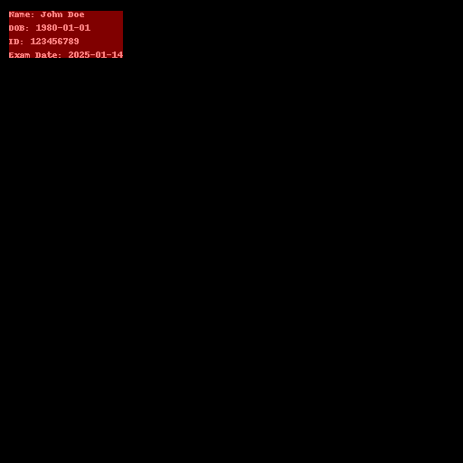
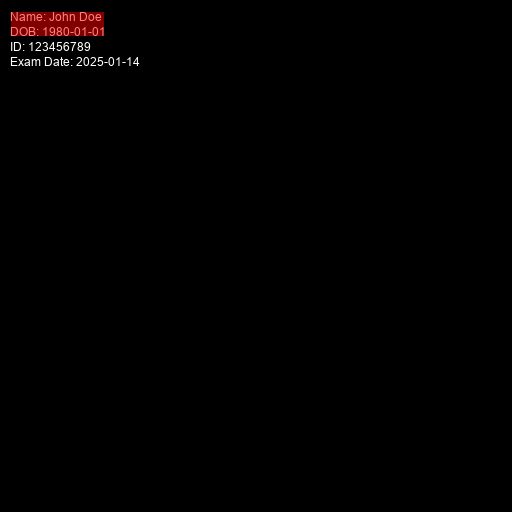

## Test Results: Burned-In PHI Detection and Masking in DICOM and PNG Files

This document summarizes the testing of this program, designed to identify and mask burned-in Protected Health Information (PHI) in DICOM images and regular PNG files. 

## Test Scenarios and Results

### 1. **DICOM File with No Text**
- **Test Description:** A DICOM file containing no text on the image.
- **Result:** The program handled this case correctly, with no errors or false detections.

### 2. **DICOM File with Default Font**
- **Test Description:** A DICOM file with text rendered in the default font (DICOM standard or modality-specific font).
- **Result:** Tesseract OCR successfully detected all the text in the image. The program masked ("burned") all detected text correctly.

### 3. **DICOM File with Arial Font**
- **Test Description:** A DICOM file with text rendered in the Arial font.
- **Result:** Tesseract OCR detected only the first two lines of text. The program masked these lines successfully but missed the remaining text.

### 4. **Regular PNG Files with Bounding Box Input**
- **Test Description:** PNG files tested with user-specified bounding boxes provided as input to restrict the detection region.
- **Result:** The program successfully detected and masked text within the bounding box. Text outside the bounding box was ignored, as intended.

## Summary
The program demonstrates robust handling of burned-in PHI under various scenarios, with some limitations in font-specific OCR detection accuracy. Bounding box functionality works as expected for manual region constraints in non-DICOM images.

 
